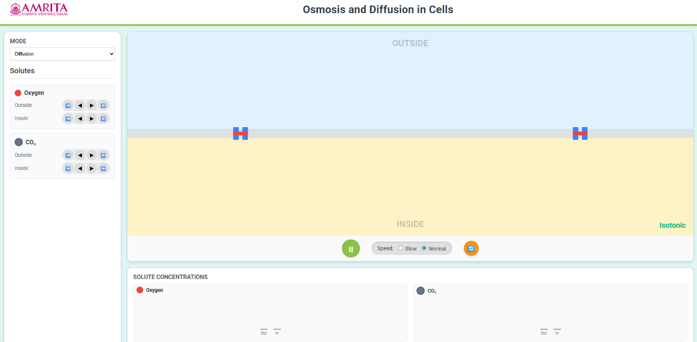
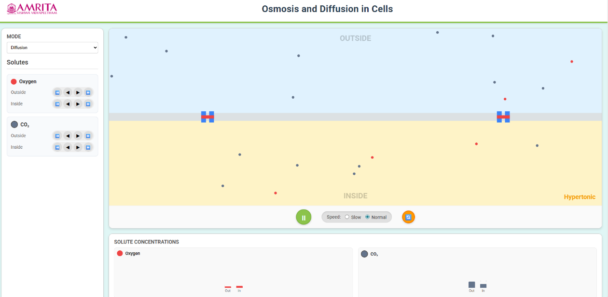
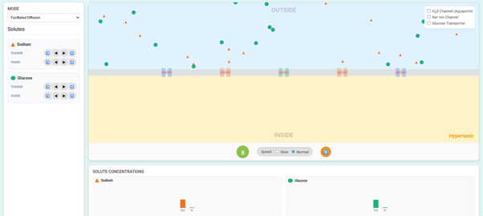
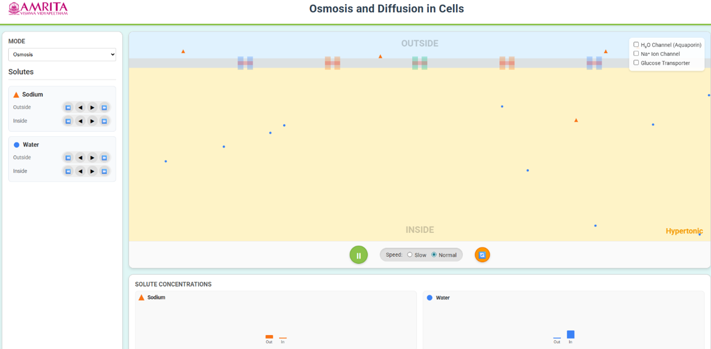

### Steps to work the simulator

1.Users can open the simulator window. The GUI provides different selection tabs such as: 
• Mode selection panel (Diffusion/Facilitated Diffusion/Osmosis).  
• Solute controls (Oxygen and CO₂). 
• A central cell membrane interface showing “Inside” and “Outside” regions.  
• A solute concentration graph panel. 

  

&nbsp;

&nbsp;
 
2. Users can select the mode of transport by clicking on the “MODE” dropdown. Select a different transport mechanism, like 1. Diffusion allows the movement of solutes (e.g., O₂, CO₂) directly across the membrane along the concentration gradient. 2. Facilitated Diffusion allows the movement of specific solutes (e.g., Na⁺, glucose) through membrane proteins such as ion channels or transporters 3. Osmosis is the movement of water across a selectively permeable membrane.

&nbsp;
 
3. The simulation of the diffusion process helps the users to identify two solutes, i.e. oxygen (red colour) and carbon dioxide (grey colour). Each solute has separate controls for inside and outside concentrations.

&nbsp;
 
4. Using the control buttons provided in the GUI, users can set the solute concentrations (oxygen and carbon dioxide) inside and outside the membrane. In the diffusion mode, changes in the concentration of one solute influence the distribution of the other, reflecting the real physiological exchange between the membrane. This establishes the concentration gradients and initial conditions for diffusion.

  

&nbsp;

&nbsp;
 
5. Based on the selected concentrations of solute, the simulator indicates the isotonic condition (equal concentration inside and outside) or hypertonic conditions (higher concentration outside), which defines the direction of net movement of solutes.

&nbsp;
 
6. The interactive GUI allows the users to start the simulation by clicking on the play button, and the molecules begin to move randomly across the membrane from a higher concentration to a lower concentration.

&nbsp;
 
7. Users can control the simulation speed by clicking on either the slow or normal radio buttons. The slow mode provides detailed observation of molecular motion, and the normal mode allows standard simulation and helps analyse molecular dynamics.

&nbsp;
 
8. The interactive GUI allows the users to observe the diffusion process and track the movement of oxygen molecules and CO2 molecules across the membrane and understand the passive transport mechanism without any energy requirement.

&nbsp;
 
9. From the simulation, users can monitor the concentration changes from the solute concentration graphs and can compare the inside and outside membrane, observe the changes over time and provide a quantitative validation of diffusion.

&nbsp;
 
10. Users can reset the simulation by clicking on the reset button, and can return to the initial state, allowing repeated experimentation.

&nbsp;
 
11. The GUI also allows users to understand the protein-mediated passive transport mechanism, facilitated diffusion, by choosing from the mode dropdown.

  

&nbsp;

&nbsp;
 
12. Users can adjust the Sodium (Na⁺) and Glucose levels inside and outside the cell to create a concentration gradient and can select the required membrane proteins such as Na⁺ ion channel, Glucose transporter and H2O channel (aquaporin).

&nbsp;
 
13. Click the play button to initiate the transport and can observe the molecules' movement along the concentration gradient through specific membrane proteins, demonstrating selective permeability.

&nbsp;
 
14. Also, users can observe the redistribution of solutes and corresponding changes from the concentration graphs from the simulation.

&nbsp;
 
15. The interactive GUI allows the users to understand the water-specific passive transport mechanism, across the selectively permeable membrane, Osmosis, by choosing from the mode dropdown.

  

&nbsp;

&nbsp;

16. Users were allowed to adjust the water and solute (e.g., sodium) levels inside and outside the cell to create a concentration difference. Also, the simulation allows enabling water channels by selecting the Aquaporin (H₂O channel) to facilitate faster water movement.

&nbsp;
 
17. By clicking the play button, users can observe the movement of water molecules across the membrane from low solute concentration to a high solute concentration (i.e., toward the hypertonic side).

&nbsp;
 
18. Also, users can observe the redistribution of water and changes in concentration graphs and tonicity conditions from the simulation.

&nbsp;
 
19. Users can reset the simulation by clicking on the reset button, and can return to the initial state, allowing repeated experimentation.
