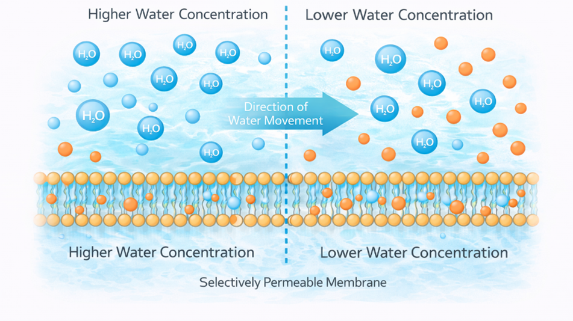

### Introduction

Cells always interact with their environment to maintain homeostasis (internal balance) to support various cellular processes. A water solution that contains nutrients, wastes, gases, salts, and other substances present around the cells makes up the external environment of the cell. The outer surface of the cell’s plasma membrane is exposed to the external environment, while the inner surface of the cell’s plasma membrane is exposed to the cell’s cytoplasm. Thus, the cell’s plasma membrane is responsible for controlling the substances that enter and leave the cell. The plasma membrane allows certain substances to pass through, but not all. Means the membrane is in a selectively permeable nature. Small molecules may pass through the membrane. The movement of substances in and out of the cell is achieved through various mechanisms. If no energy is required for substances to pass through the membrane, the process is called passive transport.  Osmosis and diffusion are two types of passive transport mechanisms in the membrane. It depends on the concentration gradient of the substances and the semipermeable nature of the cell membrane.

&nbsp;

### Osmosis
Osmosis is defined as the passive movement of water molecules across a selectively permeable membrane from an area of higher water concentration to an area of lower water concentration. The process continues until equilibrium is attained between the two solutions. The selectively permeable membrane allows water molecules to pass through while restricting the movement of certain solutes (Fig. 1). Osmosis is important for maintaining the optimal degree of cellular hydration while ensuring the stability of the internal environment.

The principle of osmosis is based on the concept of water potential and osmotic pressure. The movement of water molecules through a semipermeable membrane is based on the difference in solute concentration between two solutions. When a semipermeable membrane separates two solutions of different concentrations, water moves from one solution to the other in such a way that the concentration in both solutions becomes equal. The movement of water creates a pressure known as osmotic pressure. It is the force that acts against the flow of water.

&nbsp;

  
   
  <i>Figure 1. Diagram illustrating the process of osmosis.
</i>

&nbsp;

### Osmotic Pressure and Vant Hoff Equation

Osmotic pressure is a physical property that involves the force exerted by the movement of water across a semipermeable membrane. In biological systems, the movement of water from a region of lower solute concentration (higher water potential) to a region of higher solute concentration (lower water potential) by the process of osmosis continues until equilibrium is achieved or until the pressure exerted by the movement of water balances the difference between the concentrations. This pressure that stops the movement of water is called osmotic pressure.

The osmotic pressure can be mathematically expressed by the equation given by Van’t Hoff. This equation relates osmotic pressure to the concentration of the solute particles found in a solution. 

&nbsp;

  
   
  <i>
 
Where:

•	π = Osmotic pressure

•	i = Van ’t Hoff factor (number of particles produced when a solute dissolves)

•	C = Molar concentration of the solute

•	R = Universal gas constant

•	T = Absolute temperature (in Kelvin)

</i>

&nbsp;
From the equation, it is evident that osmotic pressure is a function of the number of solute particles found in the solution, the temperature of the system, and the extent to which the solute dissociates into particles when dissolved. Some substances dissociate into ions when they are dissolved in a solution. This dissociation increases the concentration of the solution, hence increasing the osmotic pressure. Sodium chloride is a good example of a substance that dissociates into ions.

In biological or physiological systems, the term used to describe osmotic pressure is usually osmolality or osmolarity, which is a measurement of the concentration of all the particles in a solution that exert osmotic pressure. Osmolality is the number of osmoles per kilogram of solvent, whereas osmolarity is the number of osmoles per litre of solution. This helps in measuring the osmotic pressure in a solution and predicting the flow of water across a cell membrane. Osmolality is an important term that is used in a biological context since it can be used to measure the actual number of dissolved particles contributing to osmotic pressure without regard to the composition of the solution. Normally, the osmolality of physiological fluids such as blood plasma ranges between 275 and 295 mOsm/kg. If the osmolality of the extracellular fluid increases, water leaves the cell. This causes the cell to shrink. If the osmolality of the extracellular fluid decreases, the cell swells.

&nbsp;
### Tonicity and osmotic conditions of a solution

When a cell is placed in a solution, the direction of water movement is based on the concentration of solutes. The concentration of solutes is referred to as tonicity. Tonicity is a term used to determine the movement of water during osmosis. The movement of water during osmosis is based on the concentration of solutes. The concentration of solutes can be classified as hypotonic, hypertonic, or isotonic.

**Hypotonic Solution:** A hypotonic solution is a solution whose solute concentration is lower outside the cell membrane compared to the solute concentration inside the cell. This implies that the concentration of water molecules is higher outside the cell. Due to the difference in solute concentration, water enters the cell via osmosis. As water enters the cell, it starts to swell due to increased internal pressure. 

**Isotonic Solution:** An isotonic solution is one in which the concentration of the solute inside the cell is the same as that of the solution outside the cell. In this case, the rate of movement of water molecules into and out of the cell is the same, meaning that no movement of water takes place. The cell will be of normal size and shape since equilibrium is reached inside the cell. Isotonic solutions are very important in the body, for example, in that blood plasma is isotonic with red blood cells, thus preventing them from shrinking or swelling.

**Hypertonic Solution:** A hypertonic solution is one in which the concentration of solute outside the cell is higher compared to the concentration of solute inside the cell. Therefore, the concentration of water is lower outside the cell. Hence, water is drawn out of the cell by the process of osmosis towards the region with the higher concentration of solute. This results in shrinking or shrinkage of the cell due to the loss of water or dehydration of the cell’s cytoplasm. This phenomenon is referred to as crenation in animal cells, while in plant cells it is referred to as plasmolysis.

Osmosis is a crucial process in human physiological processes within the body. It helps to balance fluids within the cells and tissues of the body and ensure that cells are of normal size and shape. Osmosis also occurs in the kidneys, where it helps to ensure the reabsorption of water from the urine. This process helps to balance fluids within the body. Osmosis occurs in the cells of the intestines, helping to ensure the digestion of nutrients. Thus, osmosis is an essential process for the maintenance of fluids within blood plasma.

